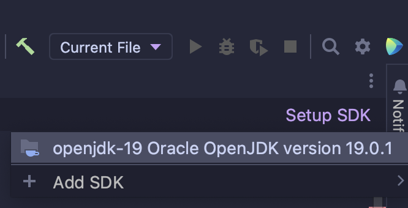

# Exercise 2.2 - 🔍 Sort & Search

## 🎯 Objectives

- **Sort** a collection of `Comparable` objects.
- **Trace** the binary search algorithm.
- **Find** a particular object in collection of `Comparable` objects using binary search.

## 🔨 Setup

1. Clone the repo (or download the zip) for this exercise, which you can find [here](https://github.com/JAC-CS-Programming-4-W23/E2.2-Sort-Search).
2. Start IntelliJ, go to `File -> Open...`, and select the cloned/downloaded folder.
3. If at the top it says "Project JDK is not defined", click "Setup JDK" on the top right, and select the JDK version you have installed on your machine.

   

4. To get the unit tests to work, open `PokemonTest.java` and add JUnit to the classpath:

   

   - Just click "OK" on the resulting dialogue window and all the test-related red squigglies should disappear.

## 🔍 Context

If after doing the last exercise you're thinking, "well, that's cool and everything, but when/why would I need to use Comparable?", then here's the answer from [the Java docs](https://docs.oracle.com/javase/8/docs/api/java/lang/Comparable.html):

> Lists (and arrays) of objects that implement [`Comparable`] can be sorted automatically by `Collections.sort` (and `Arrays.sort`).

By implementing a `Comparable` class in the previous exercise, we got sorting for free! If we keep a sorted collection of objects, then we can use the built-in Java sort methods, as long as the objects in the collection implement `Comparable`!

Once the data is sorted, we can use binary search to search for a particular element in the collection.

## 🚦 Let's Go

1. Our task is to refactor the integer binary search from the notes to use our `Pokemon` comparable class instead.
   - The end goal is to `Pokemon.binarySearch()` for any Pokemon that may exist in our collection.
   - You can use the unit tests located in `PokemonTest.java` to verify that the search is working correctly.
2. Now that we can (efficiently) search for a `Pokemon` in our collection, we want to be able to add a Pokemon from our `collection` to our `team` using the `Pokemon.addToTeam()` method.
   - The "collection" is the set of all Pokemon we might have in storage.
   - The "team" is the set of (max) 6 Pokemon that we can carry at any one point.
   - `Pokemon.addToTeam()` should:
     1. Search (using binary search, of course) for the Pokemon we want and get the index of where the Pokemon is in the collection.
     2. If the Pokemon does not exist in the collection, then throw a `PokemonNotFoundException`.
     3. Otherwise, add the Pokemon from the collection to the team.
        - You don't have to worry about removing the Pokemon from the collection.

---

*Ahhh so **that's** why they say it's `O(log n)`...*
